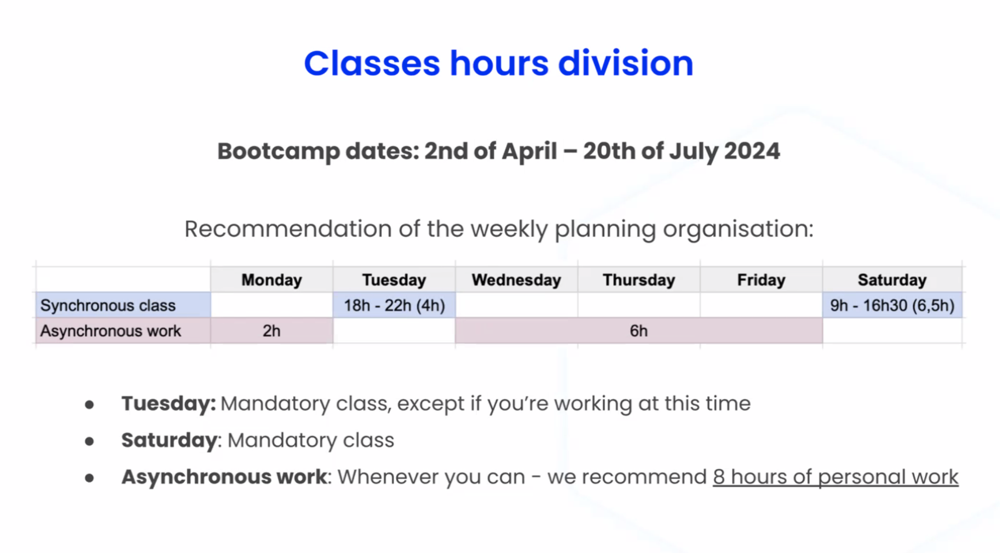

<h1 align="center">
  
</h1>

This repository serves as a guide for your class.

Where we will be learning about HTML, CSS3, Javascript, Vue & Supabase.

Created with ❤️ by Diego Zito.

Bootcamp Dates 2nd April - 20th July

<h1 align="center">
  
</h1>

## Zoom Link

[Zoom Video Link](https://ironhack.zoom.us/j/98932082308)

## Folder Structure

   
Table of Contents

   <ul>
      <li>
       <a href="">Week 1</a>
      </li>
      <li>
       <a href="">Week 2</a>
      </li>
      <li>
       <a href="">Week 3</a>
      </li>
   </ul>

## Helpful Links

- [VS Code - Video Tutorials](#vscode-video-tutorials)

  - [VS Code Install - Windows](https://www.youtube.com/watch?v=X_Z7d04x9-E)
  - [VS Code Install - Mac](https://www.youtube.com/watch?v=5vcQAfvDsz0)
  - [How to enable 'Live Server' extension within VS Code](https://www.geeksforgeeks.org/how-to-enable-live-server-on-visual-studio-code/)

- [Video Tutorials](#video-tutorials)

  - [Command Line Crash Course](https://youtu.be/uwAqEzhyjtw)
  - [HTML Crash Course - English](https://youtu.be/UB1O30fR-EE)
  - [CSS Crash Course - English](https://youtu.be/yfoY53QXEnI)
  - [Git & Github Tutorial - English](https://www.youtube.com/watch?v=HkdAHXoRtos)
  - [Git & Github Tutorial - Spanish](https://www.youtube.com/watch?v=vlCXdvcgiE0)
  - [CSS Grid Crash Course](https://youtu.be/0xMQfnTU6oo)
  - [JS Fundamentals](https://youtu.be/vEROU2XtPR8)
  - [JS Crash Course](https://youtu.be/hdI2bqOjy3c)
  - [JS Functions & Arrays Crash Course](https://youtu.be/rRgD1yVwIvE)
  - [JS - DOM Crash Course](https://youtu.be/0ik6X4DJKCc)
  - [JS - Async Await Crash Course](https://youtu.be/PoRJizFvM7s)

- [Video Project Tutorials](#video-project-tutorials)
  - [Build a Music Player | JS, HTML, CSS (Vanilla JS)](https://youtu.be/QTHRWGn_sJw)
  - [Build A Filterable List With Vanilla JavaScript](https://youtu.be/G1eW3Oi6uoc)
  - [JavaScript Password Generator](https://youtu.be/duNmhKgtcsI)
  - [Create A Simple JavaScript App to Generate QR Codes](https://youtu.be/qNiUlml9MDk)
  - [Star Ratings With JavaScript & Font Awesome](https://youtu.be/u3rylF3y3og)
  - [Simple JavaScript Slideshow In 5 Minutes](https://youtu.be/4YQ4svkETS0)
  - [SpaceX Website Clone - HTML, CSS & JavaScript](https://youtu.be/wryPX7KSwSc)
  - [Rock Paper Scissors Game - UI & JavaScript](https://youtu.be/WR_pWXJZiRY)
- [Icon Libraries](#icon-libraries)

  - [Font Awesome](https://fontawesome.com/)
  - [The Noun Project](https://thenounproject.com/)

- [Tools and Helpful Links](#tools)
  - [CSS Grid Generator](https://cssgrid-generator.netlify.app/)
  - [CSS Flex Generator](https://flexbox.help/)
  - [CSS Shadows](https://htmlcssfreebies.com/css-box-shadow-examples/)
  - [CSS Animations](https://animista.net/)
  - [CSS Buttons with Animations](https://htmlcssfreebies.com/pheasant-demure-buttons/)
  - [Media Query CheatSheet](https://gist.github.com/bartholomej/8415655)
  - [JS Operator Lookup](https://www.joshwcomeau.com/operator-lookup/)

## Git

Git is a version control tool that helps us save and follow the changes we make in a computer project.

### What is it for?

Git is very useful when we work on large projects with other programmers because it allows us to easily save and share the code we are writing and make sure everyone has the latest version of the project.

### How do we use it?

We use Git through the computer's command line, and we can do things like create a new project, save changes, and see the history of changes we have made in the project.

### Example

Let's say we are working on a simple webpage and want to make some changes to the design. We use Git to save the changes we make to the webpage files and then upload them to GitHub so other programmers can see the changes and add their own improvements.

For example, if we want to change the background color of the page to blue, we use Git to save that change to the webpage files. Then, we upload the files to GitHub so other programmers can see the change and add their own code to make the page look even better. It's like we're painting a picture together, and each one adds their own touch to make the drawing more beautiful!

## Github

GitHub is a website that allows us to save and share computer projects with other programmers.

### What is it for?

GitHub is very useful when we work on large projects with other programmers because it allows us to easily share the code we are writing and collaborate on the project. We can also use GitHub to control the versions of our project and make sure that the whole team has the latest version of the project.

### How do we use it?

We can use GitHub to upload our computer projects, add other programmers to the project, work on different versions of the project, and collaborate with other programmers on the project.

### Example

For example, if we are working on a project to create a game app, we can use GitHub to save the code we are writing, add other programmers to the project to help us write the code, and work on different versions of the game app to make sure everything is working correctly. It's like playing a team game and working together to win!

## Git Commands

Follow these steps to make changes to your repository:

### Commands to push to github

git add .
git commit -m "descriptive message about recent changes"
git push origin main

#### DRAFT

git add .
git commit -m "snfjohjfdkgdfjdo"
git push origin main
